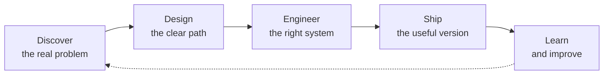

 

 

## Building useful things from ambitious ideas

I'm **Álvaro**, a Cuban software engineer based in Montevideo and the creator behind **ExagonSoft**—my personal software and product brand.

I work across the entire product journey: finding the real problem, shaping the experience, choosing an architecture, writing the code, shipping the release, and learning from what happens next. My world includes responsive web platforms, cross-platform mobile apps, cloud systems, AI-assisted products, and interactive experiences.

> **My standard is simple:** make it useful, make it trustworthy, and make it last.

<table>
<tr>
<td>🚀 <strong>Currently</strong></td>
<td>Building independent products that turn complex workflows into clear experiences.</td>
</tr>
<tr>
<td>🧠 <strong>Exploring</strong></td>
<td>Applied AI, knowledge systems, developer tooling, and evidence-grounded automation.</td>
</tr>
<tr>
<td>🤝 <strong>Open to</strong></td>
<td>Serious product collaborations and difficult engineering challenges.</td>
</tr>
</table>

## Product constellation

<table>
<tr>
<td width="50%" valign="top">

<h3>🛍️ JALA</h3>

<strong>A global bargain marketplace where timing creates opportunity.</strong>

Simpler, faster, and better-organized person-to-person commerce. I lead engineering and development as a co-founder, shipping the experience across Android and iOS.

 

[Google Play](https://play.google.com/store/apps/details?id=com.exagon_soft.jala_flutter_app&hl=en) · [App Store](https://apps.apple.com/us/app/jala-mercado-global-de-gangas/id6756188801)

</td>
<td width="50%" valign="top">

<h3>📌 PinitY</h3>

<strong>Your external memory for the internet.</strong>

Save tabs and pages, organize knowledge, synchronize it across browsers, and use AI to turn a growing personal library into something you can act on.

 

[Explore PinitY →](https://www.pinity.uk/)

</td>
</tr>
<tr>
<td width="50%" valign="top">

<h3>✨ Credraft</h3>

<strong>Professional stories built on evidence—not invention.</strong>

An AI-powered CV workspace with a transparent flow: discover public professional evidence, verify every finding, craft the story, and export a stronger résumé.

 

[Discover Credraft →](https://credraft.click/es)

</td>
<td width="50%" valign="top">

<h3>📊 Exagon Project Insights</h3>

<strong>See the story hidden inside GitHub activity.</strong>

A GitHub App and developer dashboard for exploring repositories, pull requests, issues, activity, and project statistics through the GitHub API.

 

[View the repository →](https://github.com/exagonsoft/ExagonProjectInsights)

</td>
</tr>
</table>

## The systems behind the experiences

 

| Product engineering | Platform engineering | Creative technology |
|:---|:---|:---|
| TypeScript, React, Next.js, Node.js | .NET, C#, Python, REST APIs | Flutter, Unity, interactive systems |
| Accessible UI and design systems | Firebase, Google Cloud, Docker | AI integrations and rapid prototyping |
| Product discovery through delivery | CI/CD, security, observability | Web3 and Solidity exploration |

## How I turn uncertainty into software

### Useful over flashy · Evidence over assumptions · Simple over accidental complexity

I care about interfaces people understand, architecture teams can evolve, responsible data handling, and products that create measurable value. The technology matters—but only because of what it enables.

## Signal from the code

 

## Let's create the next remarkable thing

If you're working on a meaningful product, navigating a difficult technical decision, or looking for an engineer who thinks beyond the ticket, I'd be glad to hear about it.

  

BUILD · SOLVE · CREATE · IMPROVE

